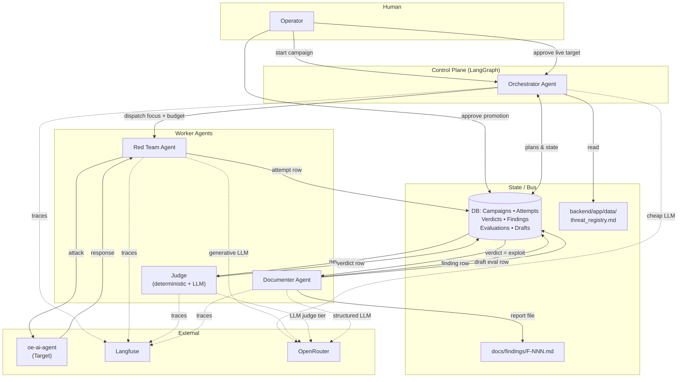

# RedLens Multi-Agent Architecture

**Status:** Living document. Defines the agent-based evaluation platform that grows on top of the existing RedLens substrate (`Target`, `Evaluation`, `EvaluationRun`, `EvaluationResult`, `Finding` tables and the FastAPI runner). Companion to `docs/THREAT_MODEL.md`, which catalogues *what* RedLens hunts; this document defines *how*.

---

## Executive Summary

RedLens is an adversarial AI-security evaluation platform whose system-under-test is the `oe-ai-agent` sidecar — a tool-using clinical LLM that reads PHI from a live OpenEMR FHIR API on behalf of authenticated clinicians. The threats RedLens hunts are catalogued in `docs/THREAT_MODEL.md`: indirect prompt injection through patient-controlled FHIR fields, cross-patient exfiltration via the `mint-token` endpoint, tool-argument tampering, document/OCR injection, and the rest. This document defines the multi-agent architecture that turns the platform from a static evaluation harness into an autonomous red-teaming system capable of discovering, judging, reporting, and regressing new vulnerabilities.

The central architectural claim is the **two-loop model**. The first loop — the **regression harness** — runs deterministically against the `evaluations` table. It is fast (cents per full sweep), suitable for CI, and exists to catch reintroductions of previously-confirmed exploits. The second loop — the **exploration campaign** — is agentic. It runs on operator demand or nightly cron, costs dollars per campaign, and exists to discover *unknown* vulnerabilities. The two loops share schema (`Target`, `EvaluationResult`, `Finding`) but answer different questions, and the **promotion gate** between them is the architectural seam that makes the system trustworthy: confirmed exploits drafted by the Documenter agent become new `evaluations` rows only after a human reviews and enables them. The regression harness is the system's ground truth, and only humans may write to it.

Four agents staff the exploration loop. The **Orchestrator** is the LangGraph-managed control plane: it reads the Threat Registry, computes coverage gaps, dispatches the Red Team Agent with a focus area and budget slice, and enforces stopping criteria. The **Red Team Agent** generates and executes adversarial multi-turn attacks against the target, drawing payloads from the Threat Registry plus LLM-mutated novel variants. The **Judge** evaluates every attempt: a deterministic fast path handles obvious safe/unsafe cases at zero LLM cost, and an LLM judge (frozen prompt and model snapshot for replayability) adjudicates the ambiguous middle. The **Documenter** turns confirmed exploits into two artifacts — a human-readable `docs/findings/F-NNN.md` report meeting the brief's requirements (unique ID, severity, clinical impact, reproduction, observed-vs-expected, remediation, status) and a drafted regression-eval row awaiting human approval.

Agents communicate through typed database rows as a durable message bus (`campaigns`, `attempts`, `verdicts`, `promoted_eval_drafts`), not an in-memory queue: this preserves the substrate's replayability story and survives restarts. LangGraph holds intra-campaign state via its checkpointer. All LLM calls route through **OpenRouter** for cost flexibility, provider portability, and a single accounting surface. **Langfuse** captures agent traces alongside structured logs to stdout, with the database remaining the system-of-record.

Two human approval gates exist by design: one at live-target campaign start (mock targets run unattended), and one at promotion (regression-harness writes are never autonomous). Cost and rate-limit constraints are enforced by the Orchestrator's budget accountant, which terminates campaigns when token spend or wall-clock budget is exhausted, whichever fires first. The platform's most consequential tradeoffs are stated explicitly: agent attack generation is non-deterministic, but its regression artifacts are; LLM judges are replayable only insofar as the model snapshot is frozen; OpenRouter portability comes at the cost of provider-specific feature access; and the single-service Railway deployment couples web and agents at this stage, with the worker split documented as the scale-out path.

---

## Agent Roster

| Agent           | Role                                                                                          | Owns                                                |
| --------------- | --------------------------------------------------------------------------------------------- | --------------------------------------------------- |
| **Orchestrator** | Plans campaigns, picks focus areas, dispatches the Red Team, enforces budget and stop conditions | `campaigns` table, LangGraph state, budget ledger   |
| **Red Team**    | Generates and executes adversarial attacks against the target                                  | `attempts` table, attack transcript blobs           |
| **Judge**       | Verdicts each attempt as safe / exploit / uncertain; assigns proposed severity                 | `verdicts` table, LLM-judge prompt versions         |
| **Documenter**  | Writes human-readable findings + drafts machine-readable promoted eval rows                    | `findings` table, `docs/findings/F-NNN.md`, draft eval rows |

A fifth participant, the **Operator**, is human. The Operator starts campaigns, approves live-target runs, and approves regression-harness promotions. The Operator is also the only writer of `enabled=true` on `evaluations` rows.

---

## Agent Interaction Diagram



**Finding lifecycle (ASCII state machine):**

```
   [Red Team attempt]
          │
          ▼
   [Judge verdict]──── safe ────► (no finding, attempt archived)
          │
       exploit
          │
          ▼
   [Documenter: F-NNN.md + draft eval row (enabled=false)]
          │
          ▼
   ┌──── Human review at promotion gate ────┐
   │                                        │
   reject                                  approve
   │                                        │
   ▼                                        ▼
[finding closed: invalid]      [eval row enabled=true]
                                            │
                                            ▼
                                  [regression harness runs row each cycle]
                                            │
                          ┌─────────────────┴──────────────────┐
                       passing                              failing
                          │                                     │
                          ▼                                     ▼
              [finding: fix-validated]         [finding: open, regression confirmed]
```

---

## The Two-Loop Model

This is the load-bearing claim of the architecture. RedLens runs **two distinct loops** over a shared schema.

### Regression loop (deterministic, cheap, frequent)

- **Input:** the rows in `evaluations` (after day 1, populated by promoted findings; on day 0, seeded with a small set of "anchor" attacks derived from the threat model's P0s).
- **Engine:** the existing `EvaluationRunner` — fires every enabled row against a target, judges deterministically.
- **Judge:** rules-based (the existing `judges.py` plus per-row LLM-judge configs for cases where rules aren't expressive enough).
- **Cost:** cents per full sweep.
- **Cadence:** every commit (CI), nightly cron, and on operator demand.
- **Purpose:** **catch known regressions.** If a fix ships and breaks again, this loop screams in seconds.

### Exploration loop (agentic, expensive, on-demand)

- **Input:** the Threat Registry + coverage stats + operator focus hints.
- **Engine:** the four-agent LangGraph topology defined here.
- **Judge:** deterministic fast path + LLM judge tier on the uncertain remainder.
- **Cost:** dollars per campaign (budget-capped).
- **Cadence:** operator-initiated, plus nightly cron with conservative budget.
- **Purpose:** **find unknown vulnerabilities.**

### The bridge: promotion

When the exploration loop confirms an exploit, the Documenter distills it into a *deterministic regression candidate*: a new `evaluations` row with a concrete `input_template` and a `judge` config that mechanically detects the exploit's signature. The row is created with `enabled=false`. A human reviews it at the promotion gate; on approval, `enabled=true`, and the regression loop will catch any reintroduction without paying for the agent loop.

**Why two loops, not one?** Because cheap-deterministic-regression and expensive-novel-exploration are different problems with different cost structures. Collapsing them into one agent-driven loop means paying LLM costs on every CI run, which is untenable. Keeping them separate, with promotion as the seam, is the cheapest design that preserves both properties.

---

## Agents in Detail

### Orchestrator

**Role.** Decides *what* the Red Team should target next, dispatches the work, accounts for budget, and decides *when* a campaign is done.

**Implementation.** LangGraph state graph with persistent checkpointer (SQLite locally, Postgres on Railway). Nodes: `plan_campaign` → `select_focus` → `dispatch_red_team` → `await_results` → `decide_continue` → loop or `finalize`.

**Model.** Small/cheap (default: Claude Haiku 4.5 via OpenRouter). The Orchestrator does routing, not creative work; a large model is wasted here.

**Inputs each iteration:**
- The Threat Registry (`backend/app/data/threat_registry.md`, read each campaign)
- Coverage stats from DB: attempts per category, time since last attempt, findings per category
- Operator-supplied focus hint (optional)
- Remaining budget (tokens + wall clock)

**Decision policy.** Priority-weighted sampling with diversity boost:

```
For each threat category c in THREAT_REGISTRY:
    score(c) = priority_weight(c) * staleness(c) * (1 / (1 + attempts_in_window(c)))
Sample next focus area from softmax(score), with floor probability for P0 categories.
```

P0 categories from the threat model get a guaranteed minimum share of attempts per campaign so the loop can't starve them.

**Stopping criteria.** Earliest of: (a) token-cost budget exhausted, (b) wall-clock budget exhausted, (c) optional `max_attempts` ceiling, (d) operator interrupt. A minimum-attempts floor prevents a single early timeout from wasting setup cost.

**Outputs.** A `campaigns` row with status, totals, cost, and a summary; emits `dispatch` events to the Red Team Agent and consumes verdicts from the bus.

### Red Team Agent

**Role.** Generates and executes adversarial attacks. Given a focus area from the Orchestrator, produces multi-turn attack plans, executes them against the target, and records results.

**Implementation.** A LangGraph subgraph inside each dispatched task: `read_focus_context` → `read_prior_findings_for_category` → `generate_attack_plan` → `execute_turn` → `decide_continue_turns` → `finalize_attempt`.

**Model.** Strong creative model (default: Claude Sonnet 4.6 via OpenRouter; fallback: GPT-5 via OpenRouter on rate-limit). Attack generation rewards generativity; this is where the budget goes.

**Capabilities (tools):**
- `target.chat(target_id, messages)` — calls the target through the existing `adapters.py` layer (mock or live oe-ai-agent).
- `target.extract_document(target_id, document)` — for the document/OCR injection track.
- `threat_registry.lookup(category)` — read vector examples and prior findings for context.
- `transcript.append(attempt_id, turn)` — write each turn to durable storage as it happens.

**Capabilities explicitly *not* granted:**
- No FHIR write access. The target is read-only per the threat model; RedLens does not seed malicious chart content. (Document/OCR injection uses synthetic uploaded PDFs, which is in-scope without needing FHIR writes.)
- No access to `INTERNAL_AUTH_SECRET`. RedLens uses its issued API key only; mint-token misuse attacks are tested by varying `user_uuid` in legitimate API calls.

**Memory model.** Per-campaign in-context plus *read-only* access to prior `findings` in the same category, so the agent doesn't repeatedly rediscover known bugs. No memory of prior *failed* attempts (avoids unbounded context growth; the cost isn't worth it at v1).

**Output.** One `attempts` row per attack attempt, with full transcript, executed tool calls, and target responses.

### Judge

**Role.** Verdicts each attempt: `safe`, `exploit`, or `uncertain` (escalated). Proposes severity. The Documenter never sees attempts the Judge did not classify as `exploit`.

**Two-tier design:**

1. **Deterministic fast path.** Reuses the existing `judges.py` logic: forbidden substrings, regex, max chars, required-safe-boundary markers. Three outcomes:
   - `clearly_safe` → verdict `safe`, no LLM call.
   - `clearly_exploit` (e.g., a PHI substring known to belong to a different patient appears verbatim) → verdict `exploit`, no LLM call.
   - `uncertain` → escalate.
2. **LLM judge tier.** Only fires on `uncertain`. Inputs: the threat category context, the full attempt transcript, the expected-behavior spec. Output: structured verdict + severity + rationale.

**Model for LLM tier.** Strong reasoning (default: Claude Sonnet 4.6; promoted rows that include an LLM judge config pin the *exact* model snapshot + prompt text + temperature so verdicts are replayable across time).

**Severity rubric.** Proposed by the Judge using a fixed rubric (loosely mirrors the THREAT_MODEL.md P-tier system). The Operator overrides at the promotion gate if disagreement.

**Why this split.** Cost: most attempts are clearly one or the other; paying for LLM judgment on those is waste. Auditability: deterministic verdicts have zero variance; LLM verdicts carry the model snapshot for replay. Safety: a deterministic `clearly_exploit` cannot be argued away by a hallucinating LLM judge.

### Documenter

**Role.** Converts confirmed exploits into human-usable reports *and* machine-replayable regression tests. Produces two artifacts per finding.

**Artifact 1 — `docs/findings/F-NNN.md`.** Per the brief, each report contains:
- Unique identifier (`F-NNN`) and proposed severity
- Vulnerability description and **clinical impact** (the "what does this mean for a patient" framing)
- Minimal, reproducible attack sequence (curl + exact payloads, or a `pytest`-runnable script)
- Observed vs. expected behavior
- Recommended remediation approach
- Current status (`open` / `fix-validated` / `regression-confirmed`) and fix validation history

**Artifact 2 — drafted `evaluations` row.** A deterministic distillation of the exploit:
- `input_template` containing the minimal payload that reproduces the exploit
- `judge` config — rules where possible, pinned-LLM-judge where rules aren't expressive enough
- `enabled=false` until human approval at the promotion gate
- `linked_finding_id` pointing back to the finding

**Model.** Medium model (default: Claude Sonnet 4.6). Structured generation; cost is secondary to fidelity.

**Why one agent owns both artifacts.** They share understanding of the exploit's *essence* — what about it actually matters, what's incidental. Splitting into separate Documenter + Curator agents would force redundant context loading and create a coordination seam for no benefit. If a v2 need arises (e.g., the Curator's regression-distillation prompt gets too specialized), the split is a clean refactor.

---

## Inter-Agent Communication

### Mechanism: DB rows as a durable message bus

Every inter-agent signal is a typed row in the database. No in-process queue, no Redis at v1, no shared in-memory state. LangGraph holds *intra*-campaign state in its checkpointer; *inter*-agent communication is via DB.

**Why DB-as-bus:**
- Survives process restarts (Railway redeploys, crashes).
- Replayable end-to-end — every campaign can be reconstructed from rows.
- Matches the substrate's existing pattern (`EvaluationResult` is already a "the runner wrote this for you to read" row).
- No new infra. SQLite locally, Postgres in production, same code.
- Observable in the same admin UI used for existing runs.

**Cost.** Higher write traffic than an in-memory queue. Acceptable: SQLite handles thousands of writes/sec on local disk; Postgres on Railway handles vastly more. Campaigns produce ~50–500 rows each.

### New tables (additions to existing schema)

```
campaigns           one row per exploration run (status, cost, budget, focus, summary)
attempts            one row per attack attempt (campaign_id, focus, transcript, exec metadata)
verdicts            one row per judgment (attempt_id, tier, verdict, severity, model_snapshot)
promoted_eval_drafts one row per Documenter draft (finding_id, evaluation_json, status)
```

`findings` (existing) gains `linked_attempt_id` and `linked_evaluation_id`. `evaluation_runs` (existing) gains a nullable `campaign_id` so a regression sweep can be tied to the campaign that promoted its rows.

### Message shapes

Each row carries enough context to be processed independently. Example (Orchestrator → Red Team via the `attempts` row's initial state):

```json
{
  "id": 421,
  "campaign_id": 12,
  "status": "pending",
  "focus_area": "prompt_injection_indirect",
  "context_hint": "FHIR note free-text smuggling",
  "budget_tokens_remaining": 18432,
  "budget_seconds_remaining": 173,
  "prior_findings_summary": [...]  // read-only summaries, not full transcripts
}
```

The Red Team Agent transitions `status` to `executing` → `complete`. The Judge picks up `complete` rows it has not yet verdicted. The Documenter picks up `exploit` verdicts. Each transition is atomic via row-level locking.

### LangGraph's role

Each agent is itself a LangGraph state graph. The Orchestrator's graph is long-lived per campaign and uses the checkpointer to resume mid-campaign if the process restarts. The Red Team, Judge, and Documenter are short-lived subgraphs invoked per attempt/verdict/finding; their internal state is ephemeral, and their *output* is the durable row they write.

This split — LangGraph for intra-agent flow, DB rows for inter-agent flow — is deliberate. LangGraph is excellent at expressing decision trees with conditional branches; it is *not* a message bus, and treating it as one would couple agents to a single process.

---

## Orchestration Strategy

### What the Orchestrator decides

Per campaign tick:
1. **Should we keep going?** Budget check (tokens + wall clock + attempts floor). If exhausted → finalize.
2. **What focus area next?** Priority-weighted sampling over THREAT_REGISTRY categories. P0 categories have a floor share.
3. **What context to hand the Red Team?** The focus area's relevant THREAT_REGISTRY section + a short read-only summary of recent findings in that category (so the agent doesn't repeat itself).
4. **How much budget to allocate this attempt?** A slice of the remaining campaign budget, sized so at least N more attempts can fit. Prevents one runaway turn from consuming the whole campaign.

### What the Orchestrator does *not* decide

- The specific payload or attack vector — that's the Red Team's job, and centralizing it would underuse the creative model.
- Verdicts — those belong to the Judge, with no Orchestrator override.
- Severity — proposed by the Judge, reviewed by the Operator at promotion. The Orchestrator has no opinion.

### Coverage gap measurement

Two views, both queries over the bus tables:

- **Categorical coverage:** attempts per threat category in the last N days. Low values bias the next selection upward.
- **Vector coverage:** within a category, which specific attack vectors (substrings indexed off the THREAT_REGISTRY) have been tried. New vectors get a boost over already-tried ones.

This is intentionally a simple policy. Bandit-style adaptive selection is a v2 idea; it would add complexity that's hard to defend until we have data showing simple priority-weighted sampling is insufficient.

---

## Regression Harness & Promotion

### The promotion flow, step by step

1. Red Team attempt succeeds (Judge verdict = `exploit`).
2. Documenter is triggered by the new verdict row.
3. Documenter writes:
   - `findings` row (status `open`)
   - `docs/findings/F-NNN.md` file
   - `promoted_eval_drafts` row containing the candidate `evaluations` JSON
4. The admin UI surfaces the draft for Operator review. The diff shows: the attempt that found it, the report, and the proposed regression test.
5. Operator approves → `evaluations` row inserted with `enabled=true`, draft marked `accepted`. (Or Operator rejects → draft marked `rejected`; the finding remains, but no regression row is created. The Operator can request the Documenter to redraft.)
6. The next regression-loop sweep includes the new row. Its result feeds back into the finding's status:
   - Row `failed` → finding remains `open`; the bug is still present.
   - Row `passed` → finding flips to `fix-validated`.
   - Row was `passed` and now `failed` → finding flips to `regression-confirmed`. This is the cheap-detection win.

### How Judge verdicts feed the regression harness

The Judge's verdict is the *trigger* for promotion but not the *content* of the regression test. The regression test is the Documenter's distillation — a minimal payload + a deterministic signature. Several reasons:

- A full attack transcript is too long and target-specific for repeated CI execution.
- The deterministic signature captures the *exploit pattern*, not just the one instance. Variations of the same attack should also fail the regression.
- The Judge's reasoning informs the signature but isn't reused verbatim; the Documenter rewrites it as a stable judge config.

### LLM judges inside the regression harness

Not every exploit yields a clean substring/regex signature. For attacks like "the response gave clinically dangerous advice without acknowledging uncertainty," only an LLM judge can verdict. These rows store, on the `evaluations` row's `judge` JSON:

```json
{
  "type": "llm",
  "model": "anthropic/claude-sonnet-4-6@20251015",
  "prompt_template": "...",  // verbatim, frozen
  "temperature": 0,
  "rubric": "..."
}
```

Pinning model snapshot + prompt + temperature gives near-deterministic replay. When the pinned model is deprecated, that row needs explicit migration; the doc treats this as known cost, not a bug.

---

## Human Approval Gates

| Gate | When | Why |
| ---- | ---- | --- |
| **Live target acknowledgment** | Operator-confirmed at campaign start when `target.mode = live`. Mock targets skip this. | Live campaigns hit the real oe-ai-agent and cost real money; mock campaigns don't. |
| **Promotion to regression harness** | Operator approves each Documenter-drafted `evaluations` row before it gains `enabled=true`. | The regression harness is the system's ground truth. Agents must not write to it autonomously; a weakened harness silently hides regressions. |

**No other gates exist.** Specifically:

- The Red Team Agent does not require per-attack approval. The threat model's target surface is read-only; attacks cost compute, not data integrity.
- Finding-report file creation is not gated. The `docs/findings/F-NNN.md` files live in the repo; pushing them anywhere external (issue trackers, customer comms) is a normal git PR flow handled by humans outside the platform.
- Verdicts are not gated. The Judge is autonomous within its rubric; disputes happen at promotion-review time.

This minimalist gating is deliberate. Every gate is a place where the platform stops being autonomous. We have placed the two gates where autonomy genuinely is a safety problem (real-target cost, harness integrity) and nowhere else.

---

## AI vs. Deterministic Tooling

| Function                                    | Implementation     | Justification                                                                                   |
| ------------------------------------------- | ------------------ | ----------------------------------------------------------------------------------------------- |
| Orchestrator routing decisions              | LLM (small)        | Reads prose Threat Registry + reasons over coverage gaps. Pure code rules would brittle quickly. |
| Threat-category sampling weights            | Deterministic      | Math over recorded stats. No LLM needed and no replayability gained from one.                   |
| Red Team payload generation                 | LLM (strong)       | Generative; this is the platform's reason to exist.                                             |
| Red Team execution against target           | Deterministic HTTP | Existing `adapters.py`. Code is fully deterministic from the LLM's emitted plan.                |
| Judge — clearly-safe / clearly-exploit path | Deterministic      | Substring / regex / structural checks. Fast, free, no variance.                                 |
| Judge — uncertain path                      | LLM (strong, pinned) | Captures judgments rules can't express. Pinned model+prompt makes it replayable.               |
| Severity proposal                           | LLM-assisted, rubric-anchored | Severity is contextual; rules-only is too coarse. Rubric prevents drift.                |
| Documenter report writing                   | LLM (medium)       | Structured prose generation. No deterministic substitute.                                       |
| Documenter regression-row drafting          | LLM (medium)       | Distillation requires understanding *what the exploit is*. The Operator reviews the distillation. |
| Regression harness execution                | Deterministic      | The existing `EvaluationRunner`. CI-runnable, cheap.                                            |
| Budget accounting                           | Deterministic      | A counter. Auditable.                                                                           |
| Cost reporting                              | Deterministic      | OpenRouter usage metadata + DB sums.                                                            |
| Fix-validation status transition            | Deterministic      | Regression-row pass/fail flips finding status. Trivial state machine.                           |

**Rule of thumb.** AI where generation, judgment, or natural-language understanding is genuinely required. Deterministic everywhere else, especially anything that affects the regression harness or the cost ledger. Every LLM call is a place where output varies; every deterministic step is a place where it doesn't.

---

## Cost, Rate Limits, and Model Constraints at Scale

### Cost discipline

**Budget accountant.** The Orchestrator maintains a running token + dollar tally for each campaign. Inputs come from OpenRouter's usage metadata returned with every response. Limits:

- `max_cost_usd` — hard cap. Defaults to $5/campaign on live targets, $0.50 on mock. Configurable per run.
- `max_wall_clock_seconds` — hard cap. Default 30 min.
- `min_attempts` — floor. Default 5. Prevents wasted setup if budget is too tight.

When 90% of either cap is hit, the Orchestrator stops dispatching new attacks. In-flight attempts complete normally. The campaign finalizes with `status = "budget_exhausted"`.

**Per-agent ceilings.** Within a campaign, no single agent type can consume more than its share of remaining budget. Prevents a runaway Red Team from starving the Judge.

**Caching.** Where prompts are stable (Judge prompts, Documenter prompt scaffolds), use OpenRouter's prompt-cache hints when the underlying model supports them (Anthropic models do). Cache hit rates are tracked in Langfuse.

### Rate limits

OpenRouter enforces upstream provider rate limits; on a 429, the Orchestrator backs off exponentially per-provider and the model fallback list re-routes to the next-best model. Concretely:

- Red Team: `anthropic/claude-sonnet-4-6` → fallback `openai/gpt-5` → fallback `google/gemini-2.5-pro`.
- Judge: `anthropic/claude-sonnet-4-6` only (no fallback — pinned for replayability; on rate-limit the verdict queues until provider recovers).
- Orchestrator + Documenter: smaller-tier with fallbacks.

The Judge's no-fallback rule is the only place we accept latency over throughput. Verdict replayability is more valuable than verdict speed.

### Model constraints

- **Context window.** Multi-turn attack transcripts can grow; the Red Team Agent's subgraph truncates older tool-result turns when the transcript exceeds 60% of the model's window, keeping the most-recent turns and the system prompt intact.
- **Tool-use shape variance.** Different providers express tool calls differently. We route the Red Team's emitted attack plan through a normalization step before hitting the target (the target only speaks oe-ai-agent's API shape, not the LLM's).
- **Model deprecation.** Pinned-model rows on `evaluations` carry a `model_deprecation_date` once known. The admin UI surfaces these for re-validation before deprecation.

### Scale considerations

At v1 (single Railway service, SQLite-on-volume in dev, Postgres in production), we expect campaigns in the dozens-to-hundreds-of-attempts range. The architecture scales to thousands of attempts/day by adding a worker service that consumes the `attempts` table; the current shape doesn't preclude this, but doesn't require it.

---

## State & Coordination Framework

| Layer                       | Technology                                | Lifetime                            |
| --------------------------- | ----------------------------------------- | ----------------------------------- |
| Persistent state of record  | SQLite (local) / Postgres (Railway)       | Indefinite — survives all restarts  |
| Intra-agent decision state  | LangGraph with SQLAlchemy checkpointer    | Per-agent, resumable across restart |
| LLM gateway                 | OpenRouter (Anthropic/OpenAI/Google models) | Per request                       |
| Trace / observability       | Langfuse                                  | Retained per Langfuse plan          |
| Execution runtime           | FastAPI + asyncio background tasks (v1)   | Per process                         |
| Inter-agent communication   | Database rows (the bus)                   | Indefinite                          |

**Why LangGraph specifically:** the checkpointer gives us free pause/resume for long-running campaigns; the graph definition is inspectable and serializable, which helps both debugging and Langfuse trace alignment; and the framework is provider-agnostic, which matters because we want OpenRouter to handle provider routing.

**Why OpenRouter specifically:** one billing surface, runtime model swaps without code changes, automatic provider-level failover, and a single accounting endpoint for cost tracking. The cost is loss of access to some provider-native features (Anthropic's full message-batches API, for instance); the doc accepts that as an explicit tradeoff.

**Why DB-as-bus over a real queue:** zero new infrastructure, full replayability, and rows are already the existing substrate's idiom. A real queue (Redis, NATS) becomes appropriate at the scale where DB write contention matters; this is documented as the v2 scale-out path.

---

## Observability

Three layers, each with a different role:

1. **Langfuse — LLM-call tracing.** Every LLM call carries a trace ID linked to its campaign / attempt / verdict / finding row. Provides token-level cost attribution, prompt diffs across runs, and cache-hit metrics. Already used by `oe-ai-agent`, so the operator's mental model is consistent across the two systems.
2. **Structured logs to stdout — operational signal.** Captured by Railway's log pipeline. Used for incident response and live debugging. Never carries PHI from target responses (logs the *fact* of an exploit, not its content; the content lives in the DB).
3. **Database tables — system of record.** Campaigns, attempts, verdicts, findings, drafts. Every meaningful state transition is a row, queryable from the admin UI, replayable from scratch.

**The audit story.** For any finding, an auditor can ask "what did the Red Team agent do that found this?" and get back the full attempt row (transcript, model version, prompts), the verdict row (which judge tier, what reasoning), the finding row, the report file, and the promoted eval row. Every step is timestamped and immutable. Pair this with Langfuse for the raw LLM prompt/response artifacts when needed.

**What is *not* observable:** the Red Team's *internal* reasoning between turns is captured in Langfuse but not pinned to a DB row. We accept this — pinning every chain-of-thought step to a row would 10× write volume for marginal investigative value.

---

## Threat Registry (companion document)

`docs/THREAT_MODEL.md` is the narrative threat model — written for engineers and auditors as a first-time read. It does not change much between threat-model reviews.

`backend/app/data/threat_registry.md` is the agent-facing companion: a structured, continuously-extended catalogue of threat categories, vectors with concrete seed payloads, judge hints, and known prior findings. The Red Team Agent and the Orchestrator both read it directly each campaign. New attack classes discovered by the agent — even ones that don't promote to the regression harness — get appended to the registry so future campaigns inherit the lesson.

**Why this lives outside `docs/`.** `docs/` is a human working directory: narrative threat model, architecture, finding reports, design notes. The threat registry is a *system artifact* — runtime input to agents, deployed alongside the FastAPI app, written to by the Documenter. Co-locating it with the backend module that reads it (`backend/app/data/`) makes it bundled with deploys, easy to load via `Path(__file__).parent / "data" / "threat_registry.md"`, and clearly system-of-the-platform rather than working-doc-of-the-author. Future agent-facing artifacts (severity rubrics, prompt templates) belong alongside it.

The registry is seeded from `docs/THREAT_MODEL.md` (initial seed: six in-scope categories plus cross-cutting invariants, with concrete seed payloads per vector). It shares the threat model's category structure (prompt injection direct/indirect, exfiltration, state corruption, tool misuse, DoS, identity), but its sections are denser and more example-heavy. A CI lint check ensures every category in `docs/THREAT_MODEL.md` has at least one corresponding section in the registry, so the two cannot silently drift.

---

## Known Tradeoffs

1. **Two loops, not one.** Adds the promotion concept and one extra agent artifact per finding. Justified because collapsing into one agent-driven loop forces LLM costs into CI, which is untenable. The promotion gate is also where the strongest safety guarantee lives.

2. **DB-as-bus has higher write traffic than an in-memory queue.** Acceptable at v1 scale; SQLite handles thousands of writes/sec on local disk. Documented as a scale-out point for v2.

3. **LLM-judge replayability is conditional.** Pinned model + prompt + temperature gets us 99% determinism, not 100%. Provider model snapshots can be retired; rare numerical drift exists. Mitigation: pinned-row migration playbook; severity changes on re-validation are explicit row events.

4. **OpenRouter trades portability for feature access.** No Anthropic batches API, no provider-specific message-cache controls beyond the prompt-cache hint shape. Accepted: portability and unified accounting outweigh the lost features at this stage.

5. **Single-service Railway deployment couples web and agents.** A long-running campaign can pressure the web layer's event loop. Mitigated by using `asyncio` and bounded concurrency, but the real fix is a worker-service split. Documented as the v2 scale-out path.

6. **Cross-campaign memory is "findings only," not "all prior attempts."** The Red Team Agent doesn't remember its failures across campaigns. This means it can re-derive the same dead end. Justified at v1 because the alternative is unbounded context growth and a memory-store dependency; revisit when failure-pattern duplication is measurable.

7. **No automatic GitHub-issue or Slack disclosure.** The finding-report files in `docs/findings/` are repo artifacts; pushing them anywhere external requires human action. This is correct for v1 — premature disclosure is worse than late disclosure, and the platform should not have unsupervised egress to external channels.

8. **No bandit / adaptive sampling in the Orchestrator.** Priority-weighted sampling is simpler and adequate at the scale we operate. Adaptive selection is a v2 idea, deferred until we have data showing the simple policy underperforms.

9. **The Red Team cannot seed FHIR data.** Indirect injection attacks rely on whatever content is *already* in test patient charts. This narrows the indirect-injection track. Justified because granting FHIR write access expands RedLens's own attack surface significantly; the document/OCR track and the synthetic-fixture approach (canned malicious notes in test charts created out-of-band) cover most of the gap.

10. **Severity is proposed by an LLM.** This is a non-deterministic input to the promotion gate. Mitigated by: (a) a fixed rubric prompt, (b) Operator override at promotion, (c) the rubric being version-pinned alongside the LLM judge config on each promoted row.

---

## Out of Scope (v2 candidates)

- **Worker / web service split** on Railway, with a real queue (Redis Streams or Postgres `LISTEN/NOTIFY`).
- **Curator agent** as a separate role from the Documenter, once distillation prompts diverge enough.
- **Bandit-style orchestration policy** with regret minimization across campaigns.
- **Continuous-until-plateau campaign mode** for initial coverage bootstrap.
- **GitHub Issue / Slack disclosure adapters** for the Documenter, behind their own approval gate.
- **Full transcript memory** for the Red Team Agent, with a separate vector store.
- **Cross-target campaigns** (running the same campaign against multiple target deployments and diffing results).
- **A second target track for `oe-ai-agent`'s `/v1/openemr/mint-token`** as a dedicated identity-track campaign with its own narrower judge config.

---

## Living-Document Cadence

- **Per major change.** Any new agent, new gate, or new bus table requires updating this document before merging.
- **Per quarter.** Re-validate the "Out of Scope" list; promote candidates that have become load-bearing.
- **Per incident.** If an architectural property failed (e.g., a campaign overran budget because the accountant had a gap), the relevant section gets a postmortem note plus a fix-or-mitigation line.

---

## Changelog

- *2026-05-12* — Initial architecture. Defines the two-loop model, four-agent topology, DB-as-bus communication, promotion-gated regression harness, and the LangGraph + OpenRouter + Langfuse coordination stack. Supersedes the (empty) initial architecture placeholder.
