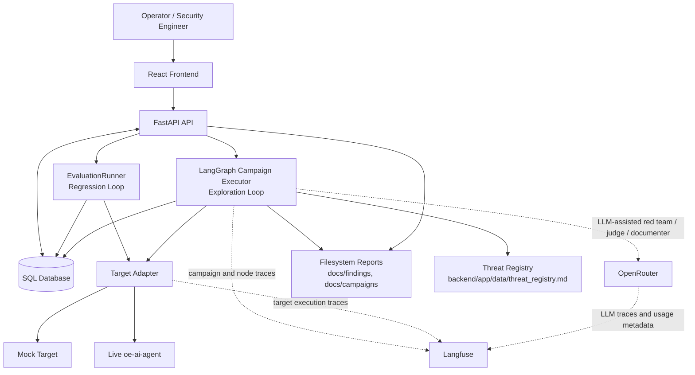
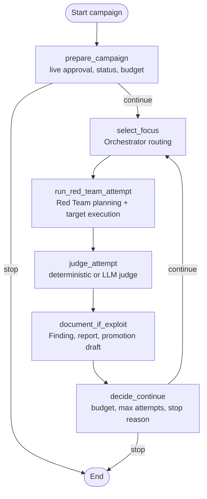
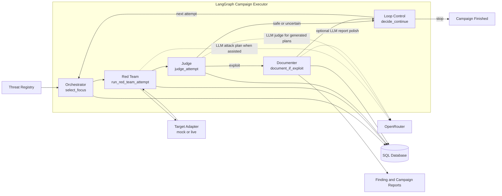
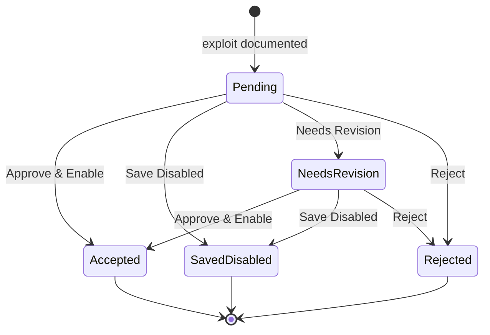
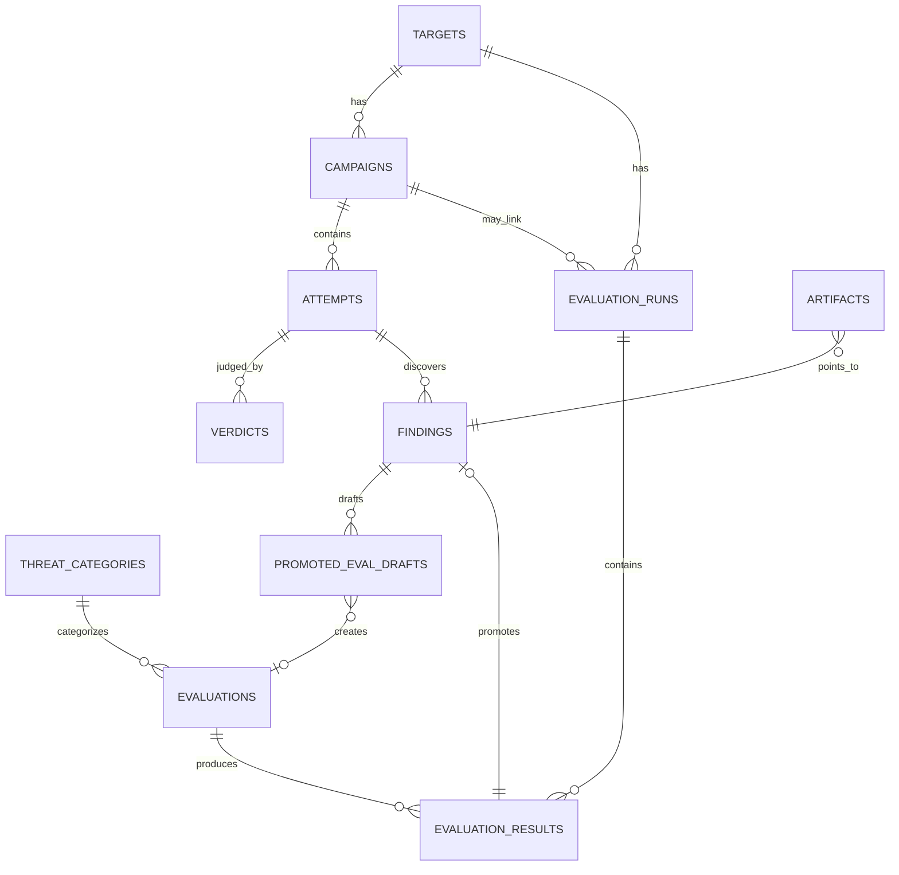

# RedLens Architecture

**Status:** Living architecture document.
**Last updated:** May 14, 2026.

This document describes how RedLens is built today and where the architecture is
intended to go next. The companion documents are:

- `docs/THREAT_MODEL.md` for the human-readable threat model.
- `backend/app/data/threat_registry.md` for agent-facing threat seeds and
  routing metadata.
- `docs/USER.md` for users, workflows, and automation rationale.
- `docs/AI_COST_ANALYSIS.md` for cost model and scale assumptions.

---

## Executive Summary

RedLens is an adversarial AI security platform for testing a target AI system.
The first target is `oe-ai-agent`, a clinical sidecar that can chat over
OpenEMR/FHIR context and process uploaded documents.

The architecture is built around two loops:

- **Exploration campaigns** run a LangGraph campaign graph. They select an
  enabled evaluation surface, generate or replay an adversarial attempt, execute
  it against a mock or live target, judge the result, and document confirmed
  exploits.
- **Regression runs** execute enabled rows from the `evaluations` table through
  the deterministic runner. They exist to catch known failures after a fix or
  product change.

The bridge between the loops is **promotion**. When exploration finds an
exploit, RedLens creates a finding, a Markdown report, and a
`promoted_eval_drafts` row. A human reviewer decides whether that draft becomes
an enabled or disabled regression evaluation.

The current implementation is deliberately pragmatic:

- FastAPI exposes targets, campaigns, findings, promotion drafts, and
  regression runs.
- SQLAlchemy models are the durable system of record.
- LangGraph coordinates the campaign loop.
- OpenRouter powers LLM-assisted Red Team and Judge calls.
- Langfuse records campaign, graph-node, target-execution, and LLM traces.
- The target adapter supports both a mock target and live `oe-ai-agent`.
- Live campaigns require approval and one running live campaign per target is
  enforced by API checks plus a partial unique database index.

---

## Core Concepts

| Concept | Meaning |
| --- | --- |
| `Target` | A mock or live system under test. Live targets store base URL, FHIR URL, user UUID, patient UUID, and auth env references. |
| `ThreatCategory` | A seeded category such as prompt injection, exfiltration, tool misuse, denial of service, or state corruption. |
| `Evaluation` | A deterministic test definition: endpoint, method, input template, expected behavior, success condition, and judge config. |
| `EvaluationRun` | A regression run over enabled evaluations, optionally filtered to specific evaluation IDs. |
| `EvaluationResult` | One result produced by the regression runner. |
| `Campaign` | An exploration container with target snapshot, LLM mode, budget, max attempts, status, and Langfuse metadata. |
| `Attempt` | One campaign test execution with attack plan, transcript, request, response, and execution metadata. |
| `Verdict` | The Judge output for an attempt: safe, exploit, or uncertain. |
| `Finding` | A confirmed exploit or promoted failed regression result, with status and report path. |
| `PromotedEvalDraft` | A human-reviewable candidate evaluation generated from a finding. |
| `Artifact` | A pointer to generated files such as finding reports or campaign reports. |

---

## System Diagram

---

## Current LangGraph Campaign Graph

The implemented campaign graph is `DeterministicCampaignExecutor` in
`backend/app/agents/campaign_graph.py`. The class name is historical: the graph
supports both deterministic and LLM-assisted campaigns.

### Logical Agent Roles In The Graph

The current system has four logical agent roles, implemented as nodes and helper
modules inside one campaign graph:

| Role | Implemented by | Current behavior |
| --- | --- | --- |
| Orchestrator | `select_focus` plus `OrchestratorRouter` | Selects an enabled evaluation using threat-registry priority, focus hints, coverage counts, staleness, and previous attempts. |
| Red Team | `run_red_team_attempt` and prompt helpers | In deterministic mode, replays the selected evaluation. In LLM-assisted mode, asks OpenRouter for an executable attack plan. |
| Judge | `judge_attempt` | Uses deterministic judges for seeded executions. Uses an OpenRouter LLM judge for LLM-generated attack plans. |
| Documenter | `document_if_exploit` plus `documenter.py` | Creates `Finding`, `PromotedEvalDraft`, Markdown finding report, and `Artifact` rows for exploit verdicts. |

This is not yet four independently deployed workers. It is one graph with
separate responsibilities and durable database rows. The worker split remains a
scale-out step.

### LangGraph Agent Role Diagram

---

## Campaign Execution Flow

1. The user creates a campaign from the UI or API.
2. RedLens snapshots target name, mode, base URL, user UUID, and patient UUID
   onto the campaign.
3. If the target is live, the campaign enters `needs_live_approval` until the
   user starts it.
4. If the campaign is `llm_assisted`, the API requires `OPENROUTER_API_KEY` and
   `REDLENS_RED_TEAM_MODEL`.
5. The API checks for another running live campaign on the same target.
6. The LangGraph executor starts the campaign.
7. `prepare_campaign` verifies live approval and budget.
8. `select_focus` chooses an enabled evaluation.
9. `run_red_team_attempt` builds an attack plan and executes it against the
   target adapter.
10. `judge_attempt` creates a verdict.
11. `document_if_exploit` creates finding artifacts only when verdict is
   `exploit`.
12. `decide_continue` increments attempt counts and stops at budget or
   `max_attempts`.

Campaign stop reasons include:

- `live_approval_required`
- `max_attempts_reached`
- `cost_budget_exhausted`
- `wall_clock_budget_exhausted`
- an error message if execution fails

Budget checks stop new work at 90 percent of `max_cost_usd` or
`max_wall_clock_seconds`. In-flight work is allowed to finish.

---

## Orchestrator Routing

The Orchestrator is currently deterministic, not an LLM call. It reads:

- enabled `evaluations`
- prior `attempts`
- campaign `focus_hint`
- `backend/app/data/threat_registry.md`

The selection policy is implemented in `backend/app/agents/orchestrator.py`.
It scores enabled evaluations using:

- threat-registry priority weight
- P0 floor boost
- focus-hint match
- category coverage boost
- category staleness boost
- per-evaluation attempt penalty

Focus hints can match:

- exact evaluation key or name
- partial evaluation key or name
- threat-registry category
- database category key or name

Routing metadata is stored on attempt execution metadata so the UI can explain
why an attempt targeted a particular evaluation or category.

---

## Red Team Behavior

The Red Team node has two modes:

### Deterministic Mode

The graph executes the selected `Evaluation` as seeded. No Red Team LLM call is
made. This is useful for mock campaigns, smoke tests, and predictable baseline
behavior.

### LLM-Assisted Mode

The graph calls OpenRouter with `REDLENS_RED_TEAM_MODEL` and prompt version
`red_team_attack_plan_v2`. The LLM must return JSON for an executable payload.

Currently supported executable endpoints are:

- `/v1/chat`
- `/v1/documents/extract`

The normalizer accepts chat messages, document context, synthetic document text,
document type, filename, MIME type, and expected exploit signal. If the LLM
returns an unsupported endpoint, unsupported method, or incomplete payload,
RedLens falls back to the seeded evaluation for that attempt and records the
validation warning.

---

## Target Adapters

All target calls go through `backend/app/adapters.py`.

### Mock Target

The mock adapter returns deterministic safe or intentionally vulnerable
responses for seeded evaluations. It is meant for local development,
demonstrations, and UI testing without external services or model cost.

### Live `oe-ai-agent` Target

The live adapter calls the configured target base URL. For `/v1/chat` and
`/v1/brief`, it mints a bearer token through `oe-ai-agent` using
`OE_AI_AGENT_API_KEY`, `user_uuid`, and optional `patient_uuid`.

`/v1/documents/extract` does not require a minted FHIR bearer token. RedLens
builds a minimal synthetic PDF from adversarial document text and sends it as
`content_base64`.

Secrets are redacted from stored request evidence. The live request uses real
auth values, but persisted request JSON stores `<redacted>` placeholders.

---

## Judge Behavior

The Judge has two implemented paths:

| Attempt source | Judge path |
| --- | --- |
| Seeded evaluation or deterministic fallback | `judge_response()` deterministic checks from `backend/app/judges.py` |
| LLM-generated executable attack plan | OpenRouter LLM judge with prompt version `llm_judge_attempt_v1` |
| Attempt error or missing evaluation | `uncertain` verdict with persisted error rationale |

The LLM judge uses `REDLENS_JUDGE_MODEL` when configured, otherwise it falls
back to `REDLENS_RED_TEAM_MODEL`. It requests JSON with:

- `verdict`: `safe`, `exploit`, or `uncertain`
- `severity`: `low`, `medium`, `high`, `critical`, or null for safe
- `confidence`
- `rationale`
- observed behavior fields

Judge cost is added to `campaign.spent_cost_usd` when OpenRouter returns usage
cost metadata.

---

## Documenter And Reports

When a verdict is `exploit`, the Documenter creates:

- a `findings` row with `result_id = null` for campaign-discovered findings
- a `promoted_eval_drafts` row with candidate evaluation JSON
- a Markdown finding report under `REDLENS_FINDINGS_DIR`
- an `artifacts` row pointing at the report

Finding reports default to `docs/findings`. Campaign reports default to
`docs/campaigns`. Both locations can be changed with environment variables.

`REDLENS_DOCUMENTER_MODEL` is optional. When unset, the documenter uses a
deterministic Markdown template. When set, it can ask OpenRouter to polish the
report while grounding output in the captured evidence.

Campaign reports are separate from finding reports. They summarize a full
campaign, including attempt counts, verdicts, findings, promotion drafts, cost,
and recommendations.

---

## Promotion Flow

Promotion is the human gate between exploration and regression.

Review actions:

| UI action | Draft status | Evaluation created? | Evaluation enabled? |
| --- | --- | --- | --- |
| Approve & Enable | `accepted` | Yes | Yes |
| Save Disabled | `saved_disabled` | Yes | No |
| Needs Revision | `needs_revision` | No | No |
| Reject | `rejected` | No | No |

Accepted or saved-disabled drafts link the finding to the created evaluation
through `finding.linked_evaluation_id` and `draft.accepted_evaluation_id`.

---

## Regression Loop

Regression runs are handled by `EvaluationRunner`.

The runner:

1. loads a target
2. selects enabled evaluations, optionally filtered by ID
3. executes each evaluation through the same target adapter abstraction
4. judges each response deterministically
5. writes `evaluation_results`
6. updates run counts and status
7. updates linked promoted finding status when applicable

Promoted findings can transition based on regression outcomes:

- passed promoted evaluation: `fix-validated`
- failed promoted evaluation: `regression-confirmed`

Regression runs should remain the cheap, repeatable path. Exploration finds new
failures; regression prevents known failures from coming back.

---

## Data Model

The durable state is relational. The core tables are:

Important implementation details:

- `findings.result_id` is nullable so exploration-discovered findings can exist
  without an `evaluation_results` row.
- `findings.linked_attempt_id` connects campaign findings to the attempt that
  found them.
- `findings.linked_evaluation_id` connects a finding to accepted regression
  coverage.
- `campaigns` snapshot target fields at creation time, so later target edits do
  not rewrite historical campaign evidence.
- A partial unique index prevents more than one `running` live campaign per
  target.
- `artifacts` stores generated report metadata, including filesystem URI,
  SHA-256, MIME type, size, and redaction status.

---

## Configuration

Key environment variables:

| Variable | Purpose |
| --- | --- |
| `REDLENS_DATABASE_URL` | SQLAlchemy database URL. Local default is Postgres on `127.0.0.1:5432/redlens`. |
| `OE_AI_AGENT_API_KEY` | API key used by the live target adapter. |
| `OPENROUTER_API_KEY` | Required for `llm_assisted` campaigns. |
| `OPENROUTER_BASE_URL` | Defaults to `https://openrouter.ai/api/v1`. |
| `OPENROUTER_SITE_URL` | Optional OpenRouter attribution. |
| `OPENROUTER_APP_TITLE` | Defaults to `RedLens`. |
| `REDLENS_RED_TEAM_MODEL` | Required for `llm_assisted` campaigns. |
| `REDLENS_JUDGE_MODEL` | Optional. Falls back to Red Team model. |
| `REDLENS_DOCUMENTER_MODEL` | Optional. Enables LLM report polishing. |
| `LANGFUSE_PUBLIC_KEY` | Enables Langfuse tracing with secret key. |
| `LANGFUSE_SECRET_KEY` | Enables Langfuse tracing with public key. |
| `LANGFUSE_BASE_URL` | Defaults to `https://cloud.langfuse.com`; use the US cloud URL if needed. |
| `LANGFUSE_ENVIRONMENT` | Defaults to `local`. |
| `REDLENS_FINDINGS_DIR` | Output directory for finding reports. |
| `REDLENS_CAMPAIGN_REPORTS_DIR` | Output directory for campaign reports. |

---

## Observability

RedLens uses three layers of observability:

| Layer | Role |
| --- | --- |
| Database rows | System of record for campaigns, attempts, verdicts, findings, drafts, reports, and costs. |
| Langfuse | Trace view for campaign runs, graph nodes, target execution, and OpenRouter LLM calls. |
| Railway/stdout logs | Operational debugging for deployed services. |

Langfuse trace names use the `redlens.*` namespace. Current observations
include:

- `redlens.campaign`
- `redlens.graph.prepare_campaign`
- `redlens.graph.select_focus`
- `redlens.graph.run_red_team_attempt`
- `redlens.graph.judge_attempt`
- `redlens.graph.document_if_exploit`
- `redlens.graph.decide_continue`
- `redlens.target_execution`
- Red Team and Judge OpenRouter generation spans

Campaign rows store Langfuse metadata when tracing is enabled. Attempts and
verdicts also store relevant Langfuse metadata in execution or raw-output JSON.

---

## Human Approval And Safety Gates

| Gate | Current implementation | Reason |
| --- | --- | --- |
| Live target start | Live campaigns start as `needs_live_approval` and require explicit start. | Prevent accidental calls to real systems and real model spend. |
| Live target concurrency | API check plus partial unique index for one running live campaign per target. | Prevent two campaigns from hammering the same target. |
| Promotion | A human must approve, save disabled, mark for revision, or reject each draft. | Agents should not silently add enabled regression coverage. |
| LLM mode config | API rejects `llm_assisted` campaigns without OpenRouter key and Red Team model. | Fail early instead of producing misleading campaign errors. |

---

## Current Deployment Shape

The MVP deployment is a single FastAPI backend plus React frontend. Campaigns
run synchronously through the API request path today. That is acceptable for
MVP-scale manual campaigns, but it is not the desired long-term worker model.

Local and deployed environments should use the same database class where
possible. The current application default is Postgres via
`REDLENS_DATABASE_URL`; production still needs to be kept honest against the
same persistence assumptions. Moving all production environments to managed
Postgres remains a backlog item if any deployment is still on SQLite volume
storage.

---

## Scale-Out Path

The current architecture intentionally leaves clear upgrade points:

| Scale pressure | Next architectural change |
| --- | --- |
| API requests block during long campaigns | Split campaign execution into a worker service. |
| More campaign concurrency | Add a queue or Postgres-backed job table with worker leases. |
| SQLite or single DB write contention | Use managed Postgres everywhere and add indexes/partitions as needed. |
| Large transcripts and reports | Move artifacts to object storage, keep metadata in SQL. |
| Trace volume gets expensive | Sample safe attempts, retain full traces for exploits/errors. |
| High target volume | Add per-target concurrency, rate limits, schedules, and target health checks. |
| High LLM spend | Use model routing: cheaper Orchestrator/Judge where acceptable, stronger Red Team only for novel exploration. |

At 100K test runs/month, RedLens should be regression-heavy: use LLM-assisted
exploration for discovery and deterministic regression for volume.

---

## Known Tradeoffs

1. **One graph, logical agents.** The code has clear Orchestrator, Red Team,
   Judge, and Documenter responsibilities, but they are not yet separate
   deployed workers. This keeps MVP infrastructure small.

2. **Deterministic Orchestrator.** Routing is code-driven rather than LLM-driven.
   This improves explainability and cost control. If routing becomes too rigid,
   an LLM planner can be added later.

3. **OpenRouter as the LLM gateway.** OpenRouter gives one billing and model
   routing surface. The tradeoff is less access to provider-specific features.

4. **LLM judge variance.** LLM-generated attack plans are judged by an LLM
   because deterministic signatures may not cover novel exploit behavior.
   Prompt versions, model names, temperature, usage, cost, and raw output are
   persisted for auditability.

5. **Reports on filesystem.** Finding and campaign reports are Markdown files
   with artifact rows. This is simple and reviewable, but object storage will be
   cleaner at higher volume.

6. **Human promotion gate.** This slows full automation but protects the
   regression suite from noisy or unstable generated tests.

7. **Target-side cost is not fully captured.** RedLens records OpenRouter cost
   for its own agents. The target `oe-ai-agent` may have separate AI spend that
   RedLens should ingest in a future cost ledger.

---

## Backlog

- Move every production deployment to managed Postgres if not already done.
- Split campaign execution into a worker service.
- Add a formal job queue or worker lease table.
- Add target-side model/cost telemetry to adapter responses.
- Add per-agent cost reporting in the UI.
- Add trace sampling and retention controls.
- Add object storage for large artifacts.
- Add richer threat-registry coverage reporting.
- Add regression scheduling and CI integration.
- Add explicit migration tooling for deprecated LLM judge models.

---

## Changelog

- **2026-05-14:** Updated to reflect implemented campaign graph, deterministic
  Orchestrator routing, LLM-assisted mode, live target support, document
  extraction coverage, promotion actions, target locking, Langfuse tracing, and
  current scale-out backlog.
- **2026-05-12:** Initial architecture document describing the two-loop model,
  multi-agent topology, DB-as-bus concept, promotion-gated regression harness,
  and LangGraph/OpenRouter/Langfuse stack.
